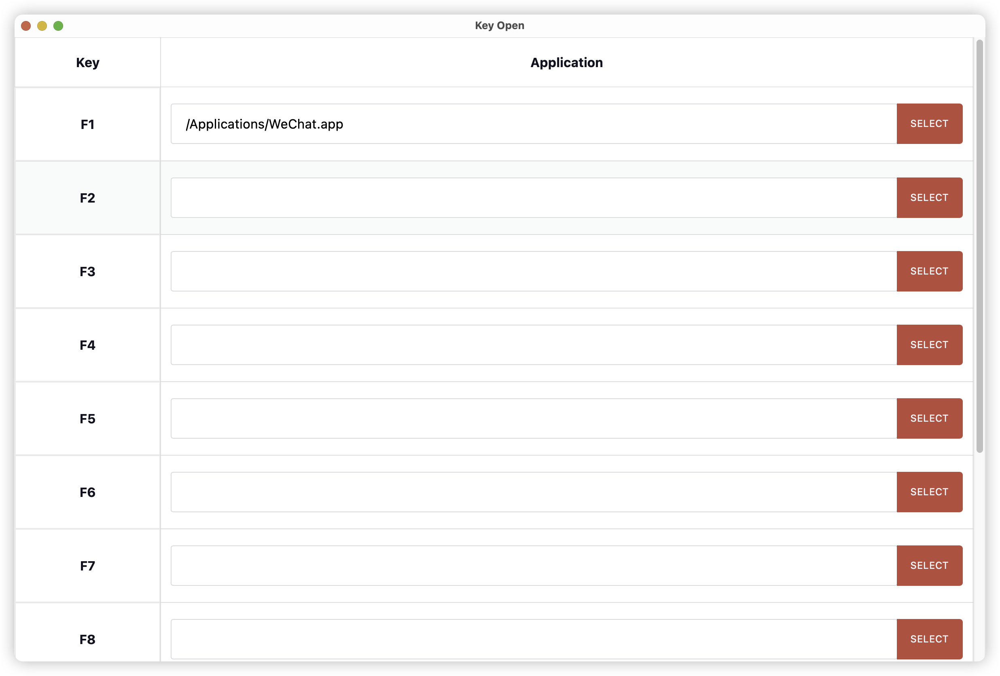

# Key Open

## Application Show

## Develop
1. run [`init.sh`](./init.sh) to initialize your environment.
2. run [`dev.sh`](./dev.sh) to run this application in a debug mod.
3. run [`build.sh`](./build.sh) to build a release.
