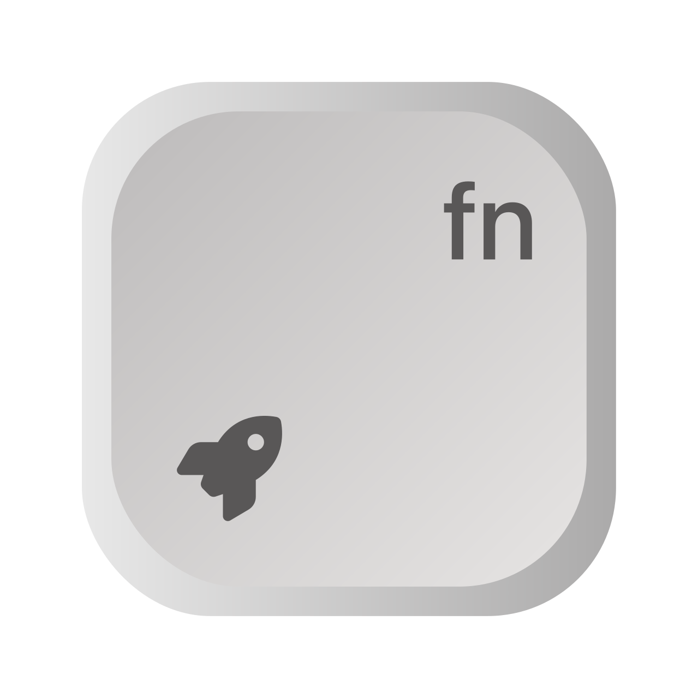

<p align="center">
<a href="./src-tauri/icons/icon.svg">

</a>
<h1 align="center">Key Open</h1>
<p align="center">A tool to open file or application quickly on mac and linux.</p>
</p>

> ***Warning***
>
> Keyopen might make the same shortcut set by other applications lose their effectiveness.

## Application Show


## FAQs
### "keyopen" has damaged, you should move it to trash
Run the following script in your terminal.
```shell
sudo spctl --master-disable
sudo xattr -rd com.apple.quarantine /Applications/keyopen.app
```

### When you cannot activate the window automatically after pressed function key...
The permission has already been added to TCC database.
You should manually activate it by following steps:
1. Open `System Settings`.
2. Enter `Privacy and Security`.
3. Select `Accessibility`.
4. Turn on the switch of `keyopen`.
5. Restart `keyopen`.

## Develop
1. Make sure `yarn` has been installed.
2. Run [`dev-v2.sh`](scripts/dev-v2.sh) to run this application in a debug mod.

## Build
### macOS
* Run `scripts/build.sh macos` to build a release.

### Linux
*Not support v2.0.0 currently*
* Change or add your target into `TARGETS` list in [`linux.sh`](scripts/linux.sh).
* Run `scripts/build.sh linux` to build a release.
