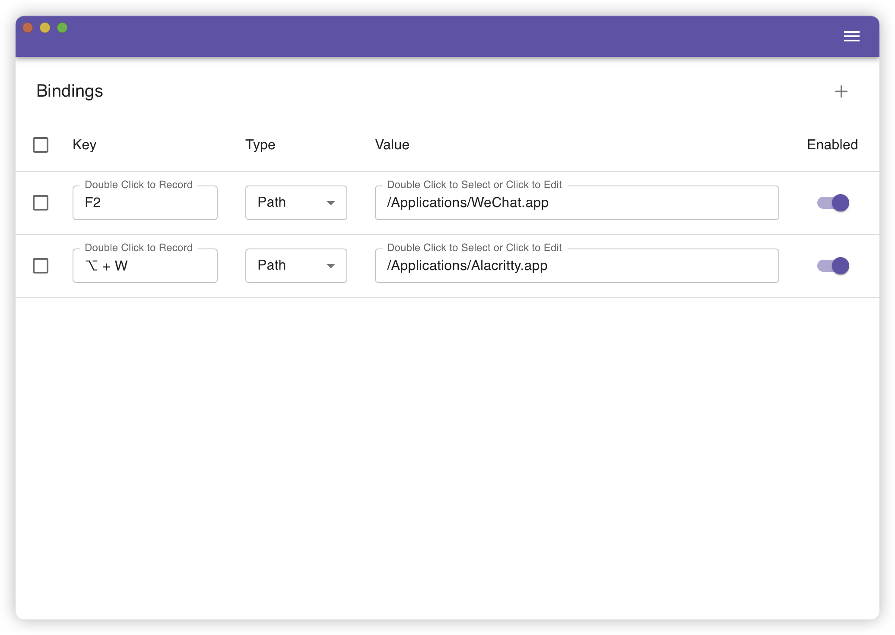

<p align="center">
<a href="./src-tauri/icons/icon.svg">

</a>
<h1 align="center">Key Open</h1>
<p align="center">A tool to open file or application quickly on mac and linux.</p>
</p>

> ***Warning***
> Keyopen might make the same shortcut set by other applications lose their effectiveness.

## Application Show


## Usage
* Use **UPPER CASE** to write a character in shortcut.
* Use `+` to connect more than one key.

### Example
If you want to open mac app store when pressing `option` and `a`, you can set the key like this:


## FAQs
### "keyopen" has damaged, you should move it to trash
Run the following script in your terminal.
```shell
sudo spctl --master-disable
sudo xattr -rd com.apple.quarantine /Applications/keyopen.app
```

## Develop
1. Run [`init.sh`](scripts/init.sh) to initialize your environment.
2. Run [`dev.sh`](scripts/dev.sh) to run this application in a debug mod.

## Build
### macOS
* Run `scripts/build.sh macos` to build a release.

### Linux
* Change or add your target into `TARGETS` list in [`linux.sh`](scripts/linux.sh).
* Run `scripts/build.sh linux` to build a release.
